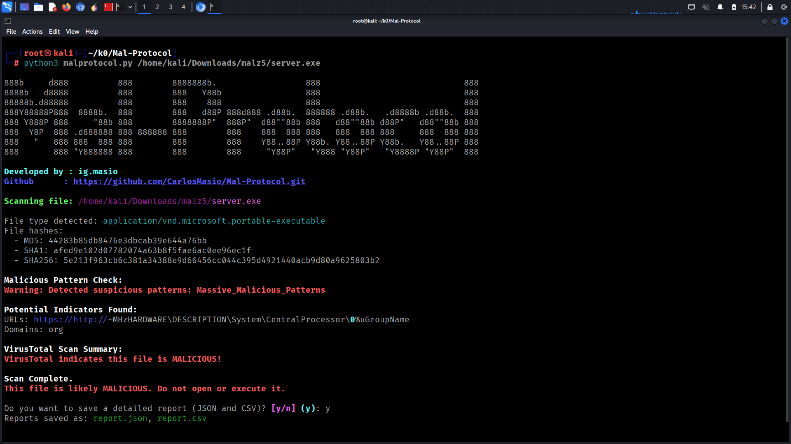
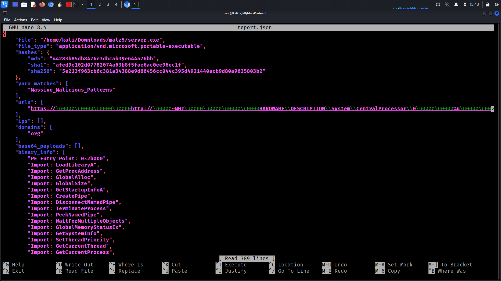
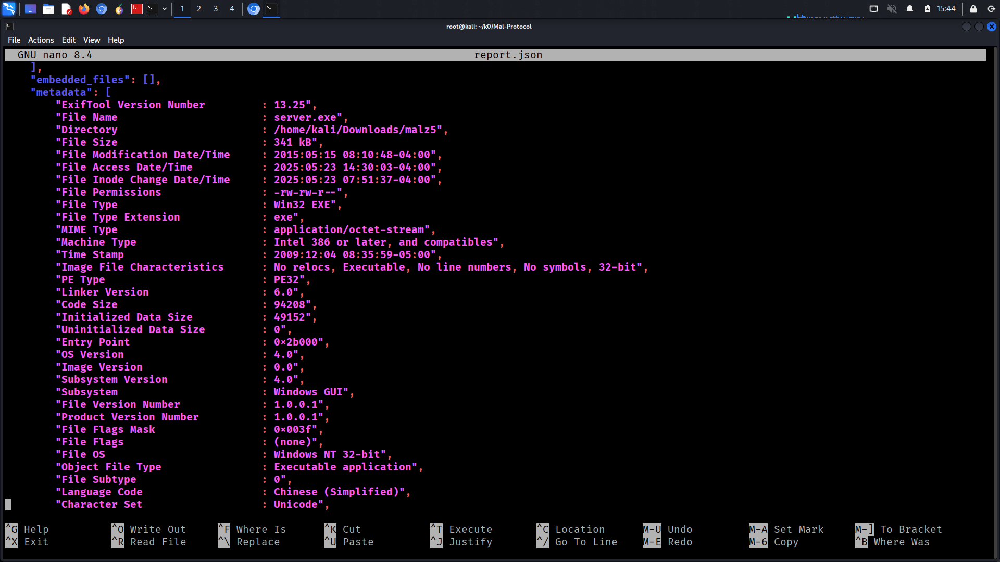

# Mal-Protocol

A terminal-based malware and payload scanner that performs in-depth analysis of all file types. Designed for cybersecurity analysts, researchers, and developers who need detailed insights into potentially malicious files.




---

## 📚 Features

* Deep static analysis of files
* YARA rule matching
* VirusTotal integration
* IOC (Indicators of Compromise) detection: URLs, IPs, domains
* Hashing (MD5, SHA1, SHA256)
* Metadata extraction using exiftool
* Packed file and archive extraction (e.g., .zip, .7z)
* Output report in JSON and CSV formats
* TUI interface using Rich for clear, human-readable results

---

## 🚀 Installation

### Step 1: Install Required System Packages

```bash
sudo apt update
sudo apt install binwalk exiftool p7zip-full python3-requests -y
```

### Step 2: Clone the Repository

```bash
git clone https://github.com/CarlosMasio/Mal-Protocol.git
cd Mal-Protocol
```

### Step 3: Set Up Python Virtual Environment

```bash
python3 -m venv myenv
source myenv/bin/activate
```

### Step 4: Install Python Dependencies

```bash
pip3 install yara-python python-magic pefile lief capstone rich pycryptodome oletools pyzipper requests
```

---

## 🔧 Usage

To scan a file:

```bash
python3 malprotocol.py /path/to/your/file
```

You will receive a human-readable scan output including hash values, YARA detection, VirusTotal verdicts, and potential IOCs. You will also be prompted to save the result as JSON and CSV.

---

## 📄 Output

* Human-readable analysis in terminal
* JSON report for automation or APIs
* CSV report for spreadsheets and reports

---

## 📁 Project Structure

```
Mal-Protocol/
│
├── core_scanner.py       # Core deep file scanning logic (YARA, hashing, extraction)
├── malprotocol.py        # Main CLI launcher tying all modules together
├── vt_lookup.py          # VirusTotal API integration
├── report.py             # JSON and CSV report generation
├── tui.py                # Terminal user interface (TUI) with rich/Textual
│
├── rules/                # Folder containing your YARA rules files (*.yar)
│    └── basic_rules.yar
│
├── config.json           # Config file holding VirusTotal API key and other settings
│
└── README.md             # Project documentation and usage instructions
```

---

## 👤 Developed By

**ig.masio**
GitHub: [https://github.com/CarlosMasio/Mal-Protocol](https://github.com/CarlosMasio/Mal-Protocol)

---

## ⚖️ License

This project is licensed under the MIT License.

---

## 🚫 Disclaimer

This tool is intended for educational and research purposes only. Do not use it for any unauthorized scanning or analysis of systems you do not own or have explicit permission to test.

---

Happy Hacking ⚡
